<!-- Cursor: open Markdown Preview (Mac: Cmd+Shift+V). Images are local files under images/2020-10-08-sdgs/. Do not paste this comment to Medium. -->

# SDGs Goal 1: A challenge to reach zero extreme poverty in Africa

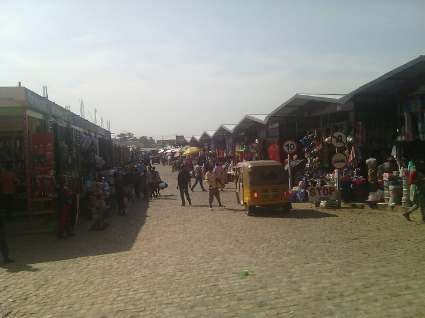

<!-- medium-cdn: https://cdn-images-1.medium.com/max/1024/1*8o4K2CXJnjTycs4ejvj9ug.jpeg -->

**1. Introduction**

— Background

The coronavirus year gave me a chance to look again at myself, and at what is actually necessary. Around my birthday I wrote this down, as a way to shift a little further.

— Outline of the project

(Who is trying to solve which social problem, and by doing what?)

**We — donors, the project members, and anyone who joins — will turn attention to the regions least likely to meet SDG 1, above all sub-Saharan Africa, the weakest point in the effort to end extreme poverty. We will start projects, speak to public opinion, and put money toward ending poverty.**

**2. The social problem we want to solve**

2.1. SDG 1: End poverty in all its forms everywhere

In 2015 the United Nations set the Sustainable Development Goals. Goal 1 includes ending extreme poverty — living on less than 1.25 US dollars a day — by 2030. By early 2019 the forecast was already that 2030 would be too soon. Is that acceptable?

2.2. The problem: the present and the history of extreme poverty

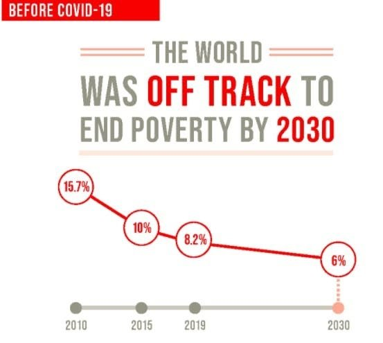

<!-- medium-cdn: https://cdn-images-1.medium.com/max/553/0*nZhRz6cKDMa6t5b6 -->

Figure 1. Pre-COVID forecast for extreme poverty in 2030

[https://sdgs.un.org/goals/goal1](https://sdgs.un.org/goals/goal1)

Figure 1 forecasts that 6 percent of the world’s people will still live in extreme poverty in 2030. If the world has 8 billion people then, that is 480 million people left behind.

Figure 2 forecasts that by the end of this year, after COVID, 71 million people will have fallen back into extreme poverty. At the end of last year the figure was about 630 million, so we are heading back toward 700 million.

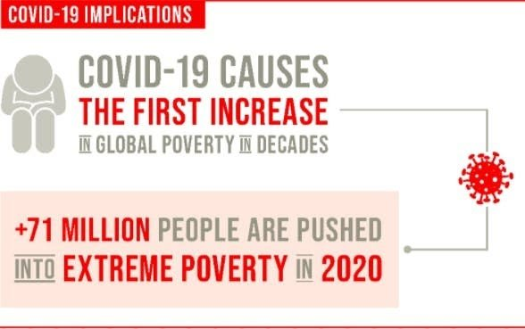

<!-- medium-cdn: https://cdn-images-1.medium.com/max/588/0*ceU2jj9bVU-yU3AL -->

Figure 2. Forecast of the number of people in poverty at the end of 2020

The IPCC *Special Report on Global Warming of 1.5°C*, published at the end of 2018, also warned that a warming climate would work against the eradication of poverty. That should not surprise anyone. When weather disasters strike, money and labour that would have gone into ending poverty are pulled away.

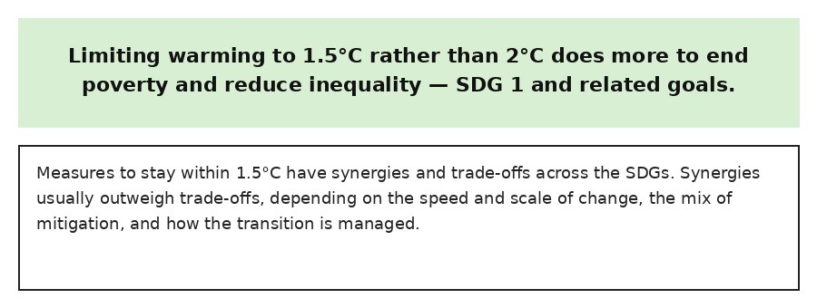

<!-- medium-cdn: https://cdn-images-1.medium.com/max/946/0*N8Cr8cMJfFyihwz- -->

Figure 3. Japanese translation of the poverty-related passages in the IPCC 1.5°C report

[https://www.wwf.or.jp/activities/data/20190204_climate_Konishi.pdf](https://www.wwf.or.jp/activities/data/20190204_climate_Konishi.pdf)

[(A short explanation appears on page 26.)](https://www.wwf.or.jp/activities/data/20190204_climate_Konishi.pdf)

If we can already see this coming, should we not act so that it does not happen?

2.3. How I came to face this problem

I used to work with two hats on: as a human-resources consultant and as a researcher in cognitive science. As a science student I studied theoretical nuclear physics and nuclear engineering. Then my father collapsed from overwork, could not return to his job, developed depression, and was ill for a long time. I changed course suddenly. I entered HR consulting, a field that would take a science graduate, and learned how companies treat employees — and how employees are treated. Because I had always been research-minded, I studied the depression my father had lived through.

After ten or fifteen years on the same topic, mental health became a business as well, and I grew tired of it. I widened the work with the times, into positive psychology and motivation.

Then work took me to the Philippines, to start global career development, and I moved there in 2013. I later learned that the Philippines is a regular in Gallup’s top ten for psychological well-being, and I went deep into happiness research: comparisons with other Southeast Asian countries, a visit to Fiji (often in the top five), and so on.

Beside Gallup’s psychological surveys there is the UN World Happiness Report, which folds in social development. There is an American finding that once annual income passes about 60,000 dollars, more income no longer raises happiness. I asked the reverse: what happens when income falls? I divided Gallup’s scores by the UN scores (a kind of standardisation) and looked at a ranking of psychological well-being that did not simply follow income. Two contiguous West African countries, Ghana and Côte d’Ivoire — one a former British colony, one a former French colony — both sat in the top ten. That meant I had to go and see. As preparatory research, in 2018 I first wanted to look at one of the lowest-income countries. I stayed away from active conflict zones, for the obvious reason of safety, and of Burundi and Malawi the itinerary came together first for Burundi. I spent about a week there. In Rwanda, which I used as a base on the way, and in Burundi, I made friends and colleagues. After I returned to the Philippines we wanted to do a project together. That is how this began.

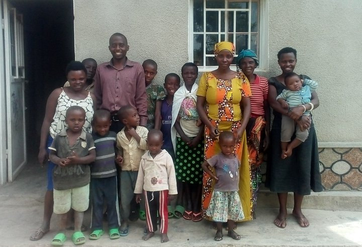

<!-- medium-cdn: https://cdn-images-1.medium.com/max/1024/1*c5HOG-RGXyGRo8P8tSnCOg.png -->

*A photograph in front of a house in the home village of François, one of the members*

I then became too busy, and I still have not made it to Ghana or Côte d’Ivoire for the happiness research.

I moved to the Philippines in 2013, but from around 2010 colleagues had already been doing social enterprise and field-based training on social problems there. From about 2015 I was doing social-issue education and social enterprise myself, beyond global career development. The idea was simply to do the same in Burundi and Rwanda.

2.4. Poverty as a planetary problem: a short history

This next part is long. Without it I cannot explain, as someone who thinks like a researcher, why this project exists.

2.4.1. The postwar start of the fight against poverty

The history of ending poverty is long, and it is intellectually and practically hard in every direction. Humanity has never finished it.

I was born in 1973. I remember the 1980s, Live Aid, “We Are the World,” and major artists trying to do something about famine in Ethiopia.

After the Second World War, many African countries became independent from colonial rule around 1960. People expected development from scratch under communism or under capital-and-democracy. It did not go that way. In the 1990s the Western donor countries (the DAC members), which had kept aid flowing since the war and since independence, took stock and tightened the tap.

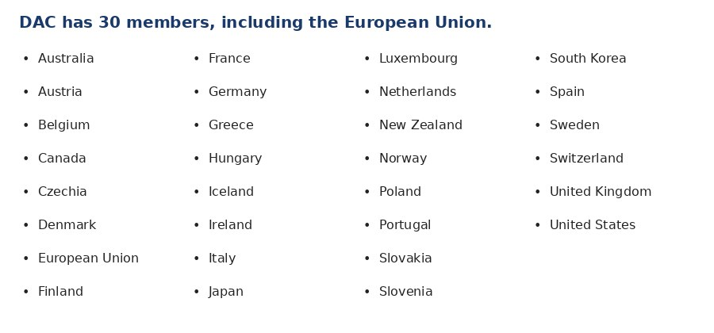

<!-- medium-cdn: https://cdn-images-1.medium.com/max/624/0*SDwVm37HxcV5wLK7 -->

Figure 4. DAC: the countries on the OECD Development Assistance Committee

[https://ja.wikipedia.org/wiki/開発援助委員会](https://ja.wikipedia.org/wiki/%E9%96%8B%E7%99%BA%E6%8F%B4%E5%8A%A9%E5%A7%94%E5%93%A1%E4%BC%9A)

Japan kept raising aid for ten years after the bubble burst, and held the floor. Nothing much changed.

At the millennium, under Secretary-General Kofi Annan, the UN made the Millennium Development Goals with Professor Jeffrey Sachs of Columbia University as an adviser. Poverty reduction was a goal there too. In Japan some people may remember projects in that stream such as *Hottokenai Sekai no Mazushisa* (“Don’t look away from world poverty”) and the White Band. Against 1990, the number of people in extreme poverty fell from 1.9 billion (of 5.3 billion) to 830 million in 2015 (of 7.3 billion). China and Southeast Asia had grown richer.

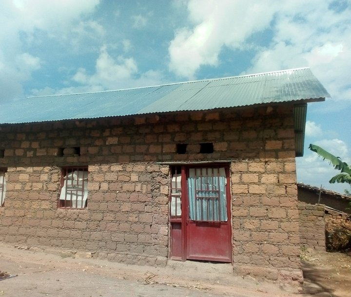

<!-- medium-cdn: https://cdn-images-1.medium.com/max/1024/1*hftrAQ4asnX4wz-WL4y3tA.png -->

*A brick house*

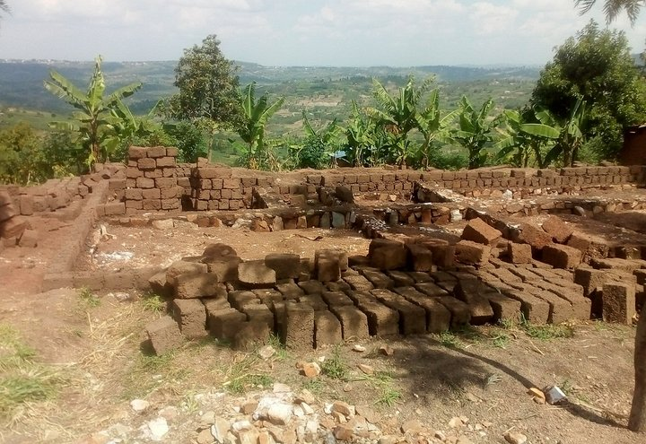

<!-- medium-cdn: https://cdn-images-1.medium.com/max/1024/1*Gp0FlruoFUrFPkguX9B3IQ.png -->

*Bricks drying. This hillside was also a site of the 1994 genocide*

Jeffrey Sachs, *The End of Poverty: Economic Possibilities for Our Time* (Japanese edition: *Hinkon no Shūen*)

[https://www.amazon.co.jp/dp/4150504040/ref=cm_sw_em_r_mt_dp_VetFFb4F2RF2J](https://www.amazon.co.jp/dp/4150504040/ref=cm_sw_em_r_mt_dp_VetFFb4F2RF2J)

It was easy to hope that by 2030 the number would ride that momentum down to zero. (I had doubted that from 2015. What about countries in war, or in postwar reconstruction? A fussy objection, perhaps. I asked UN offices, and in due course the numbers came: it looks hard after all.) The forecast is that just under 500 million people will remain — on present trends, more than 600 million. What went wrong?

Sachs, still an adviser from the MDGs into the SDGs, has said from the beginning that the aid budget is too small.

DAC members should keep the international pledge to give 0.7 percent of GNI (in everyday terms, GDP). That figure is in a 1970 UN resolution. The United States, Japan, and several Commonwealth countries (Canada, Australia, New Zealand and others) have not come close. They are not even halfway there. The Nordic countries, the United Kingdom, and Germany have kept it. France is under strain now.

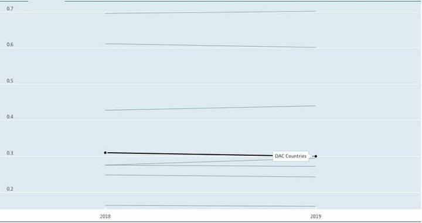

<!-- medium-cdn: https://cdn-images-1.medium.com/max/859/0*sHFon2RbB8BnPNHB -->

Figure 4. OECD statistics on each country’s ODA (you can change the view and graph any country from 1960). The DAC average is 0.3 percent — not even half of 0.7 percent. [https://data.oecd.org/oda/net-oda.htm](https://data.oecd.org/oda/net-oda.htm)

The original push came from President Kennedy in the 1960s, and before that from the United States, which had rebuilt Europe with the Marshall Plan. Why did it grow so cold? Japan was on the receiving side of postwar reconstruction. The United States rebuilt the country with trillions of yen in grants, and that became a foundation for Japan’s return.

In the early postwar years the United States spent about 1.5 percent of GDP on the world’s reconstruction. The share kept falling. By Kennedy’s time it was around 0.5 percent. He tried to lift it again. After 1970 it fell and fell.

If the large donors — the United States and Japan — had kept the pledge, development might have been finished long ago. For decades they have not. Even in the 1990s, when Japan was holding the line, the GNI ratio was about half the international pledge. That is how little money actually moved. If 1960 to 1990 was a failed thirty years after African independence, the thirty years after that were a lost thirty years as well.

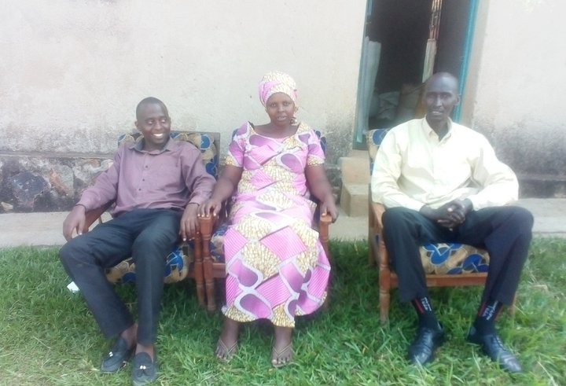

<!-- medium-cdn: https://cdn-images-1.medium.com/max/1024/1*LJWm1_Jzzcop3artiCjCoQ.png -->

*This household had almost no cash, and still served cassava and bottled Fanta*

2.4.2. Comparing what countries pay

The pledge has never been met. Researchers and campaigners say that if donors paid what they promised, and if half of that went to the least developed countries, extreme poverty could still reach zero by 2030. Can the United States and Japan do that?

The United States spends 3.5 percent of GDP on the military and plays world policeman. Social security is about half of its budget — 50 percent, against 33 percent in Japan. Even without universal health insurance, medical costs run high.

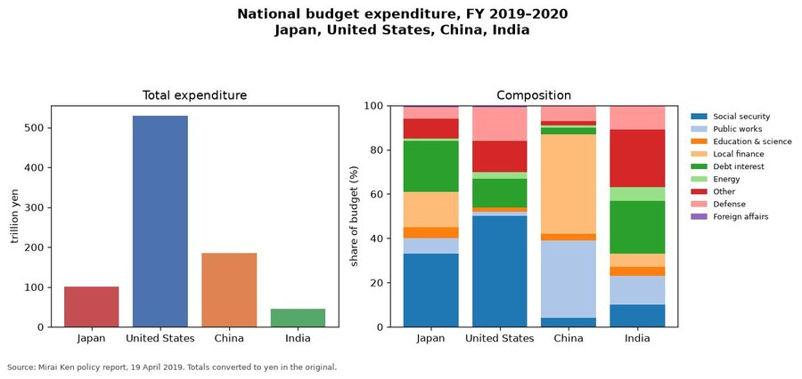

<!-- medium-cdn: https://cdn-images-1.medium.com/max/1024/0*qmM8twjuyfmUlxBW -->

Figure 5. Comparing the national budgets of Japan, the United States, China, and India

[https://www.rifj.jp/blog/日米中印各国の2019年予算を見る/](https://www.rifj.jp/blog/%E6%97%A5%E7%B1%B3%E4%B8%AD%E5%8D%B0%E5%90%84%E5%9B%BD%E3%81%AE2019%E5%B9%B4%E4%BA%88%E7%AE%97%E3%82%92%E8%A6%8B%E3%82%8B/)

In June last year, then Foreign Minister Taro Kono said at the tenth-anniversary lecture of Keio SDM that ODA, which once passed 1 trillion yen, is now a little over 500 billion yen, will not rise, and will fall further, so Japan will look harder at quality. When money was easy, Japan built tied aid — bridges, ports, roads, railways — using Japanese contractors. There is no longer the money for that, so the work will shift to transferring skills and education, things that actually have an effect. Those things move less money, so they are less visible, and the total shrinks. At home, money keeps moving from the ministries of land and education toward social security. Japan takes care of its own citizens. The rest of the world, it seems, can wait.

*Lecture by then Foreign Minister Taro Kono*

[https://www.youtube.com/watch?v=xUaWTI9bNdM](https://www.youtube.com/watch?v=xUaWTI9bNdM)

2.4.3. What countries that do not pay the pledge say

The same argument has been around for a long time. Professor William Easterly of New York University, who worked at the World Bank, says 0.7 percent is meaningless. African states are corrupt; money poured in is only siphoned off. The original plan was wrong: a poorly developed continent with many landlocked countries was never going to grow like countries on other continents.

*Easterly’s book:*

[https://www.amazon.co.jp/dp/4492443606/ref=cm_sw_em_r_mt_dp_KNwEFb184P3CV](https://www.amazon.co.jp/dp/4492443606/ref=cm_sw_em_r_mt_dp_KNwEFb184P3CV)

*A paper arguing that 0.7 percent is a fiction:*

[https://www.cgdev.org/sites/default/files/3822_file_WP68.pdf](https://www.cgdev.org/sites/default/files/3822_file_WP68.pdf)

*And a general overview:*

[https://www.globalissues.org/article/35/foreign-aid-development-assistance](https://www.globalissues.org/article/35/foreign-aid-development-assistance)

If leakage through corruption is the problem, the original sums were already too small. That is a reason to make sure the target amount is actually reached, not a reason to stop.

And if, as Taro Kono said, Japan can no longer build hardware, should it not send more people — more JICA volunteers? In the general account Japan pays about 500 billion yen, and with special accounts about 1.5 trillion. The pledge is about 4 trillion in total. Another 2.5 trillion is missing.

The number of care workers is rising. Why does the construction slump become an argument for simply leaving the money lower? The adult thing, it seems to me, would be a budget that can keep paying the 4.5 trillion yen the international responsibility implied — and a pipeline of people who are trained and actually want to go.

2.4.4. Look at the countries that do it. What is different? How far does attention reach?

There is a survey that correlates with the countries that regularly give not 0.7 percent of GNI but more than 1 percent (Sweden, Norway, and others). That is the UN World Happiness Report, the large annual study that combines social development and psychology. (Gallup also runs a psychological well-being survey; from this year Gallup is an adviser to the UN report as well.) The Nordic countries, taken to be among the most developed and the happiest, tax income very heavily, and they guarantee support and education if you lose your job. They also spend domestic budgets on social security and education. They sit near a large power, Russia, and have to spend on security with NATO. And they still spend on international cooperation.

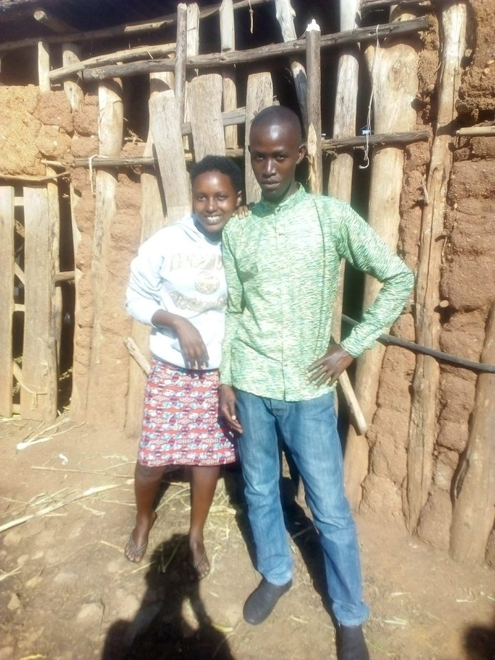

<!-- medium-cdn: https://cdn-images-1.medium.com/max/1024/1*2TG7vytZd_Ahf2OkmxiY9A.jpeg -->

*Children at the house that served cassava*

Then comes the United Kingdom, once the British Empire, still the Commonwealth. Germany pays now. France pays less. Below Germany the record is not stable — domestic politics in large European countries get in the way — but they still try. The United States, Japan, and the Commonwealth countries that are not the UK itself have not paid steadily for fifty years.

Looked at this way, states can decide this politically. The ones that do not pay have decided not to.

Izumi Nakamitsu, a UN Under-Secretary-General, has called Sweden “one of the most humane and livable social models humanity has made.” Swedes and the Swedish state live well at home, treat the earth more gently, keep other countries in view, and meet their responsibilities. Nakamitsu’s husband is Swedish; she has lived there.

*Nakamitsu’s book:*

[https://www.amazon.co.jp/dp/B073TXCVHY/ref=cm_sw_em_r_mt_dp_dhxEFb5PWMCFK](https://www.amazon.co.jp/dp/B073TXCVHY/ref=cm_sw_em_r_mt_dp_dhxEFb5PWMCFK)

(A small aside: Nakamitsu, Taro Kono, and former Gunma governor Ichita Yamamoto — Nakamitsu a little later than the others — all went through Georgetown University in Washington, D.C., and sat in or around Madeleine Albright’s seminar. It is something of an Albright school.)

About 1 percent of Japan’s people, a little over a million, live abroad. The United Kingdom, the highest among rich countries, is at 10 percent — the old empire still shows. The United States is 3 percent, which is low. Most other countries cluster between 3 and 6 percent. The Philippines, where I live, is not a rich country and not a donor; it is an aid recipient, and it is at 10 percent. It is a labour-exporting country. Remittances are about 10 percent of GDP.

How far a country can keep the outside world in view also tracks its politics: more social-democratic, or more neoliberal.

2.5. How poverty is ended

2.5.1. Micro methods of development

So we know this much. The age of hardware is over. In the past, large hardware projects were built, and money was also siphoned into corrupt, entrenched elites. Humanity has learned that “ending poverty” does not happen easily.

Countries still in civil war sit, in social development, somewhere near Japan’s Warring States period — four hundred years back — except for the brief Boshin War at the Meiji Restoration, a hundred and fifty years ago. How does humanity help found a state at that stage of development?

Poorly developed countries face three hardships: violence (war), epidemic (COVID, Ebola, AIDS), and famine (drought from climate change, locusts). Each needs its own response. States, UN agencies, and civil society already have their eyes on them.

And through those hardships, development still has to be in balance.

From his years as an adviser during the MDGs, Sachs ran the Millennium Villages Project as an empirical trial: house, work (farming), education, and community development together.

Japan:

[http://millenniumpromise.jp/](http://millenniumpromise.jp/)

Home organisation:

[https://www.millenniumpromise.org/](https://www.millenniumpromise.org/)

Commentary (Sachs’s book):

[https://www.amazon.co.jp/dp/4150504040/ref=cm_sw_em_r_mt_dp_AuxEFbKS9EXA9](https://www.amazon.co.jp/dp/4150504040/ref=cm_sw_em_r_mt_dp_AuxEFbKS9EXA9)

In the Philippines an NGO with a similar idea has passed 800 villages and is trying to bring poverty to zero: five million households by 2024, working since 1999.

[https://en.wikipedia.org/wiki/Gawad_Kalinga](https://en.wikipedia.org/wiki/Gawad_Kalinga)

In Cebu province, where I live, extreme poverty is still about 20 percent. On Negros, the agricultural island where the English school I ran is based, it is still about 40 percent. That is how it is in middle-income countries with a wide gap. If you only visit, or only see the city, you pass an urban slum and think you know. You simply never see life in the villages and the hills.

Middle-income countries are still the better case. They have industry (services, manufacturing) and some kind of national budget. It is not hopeless. Gawad Kalinga is building communities village by village and pushing toward the end of poverty.

Sachs’s Millennium Villages, by contrast, have stayed closer to experimental sites. They have not been rolled out at scale across the 48 countries of sub-Saharan Africa.

In aid debates you also hear that ODA no longer matters, because for decades the global economy and foreign direct investment have grown to several times ODA. Even if Africa is “the last continent” and business money is arriving, that money lifts the profits of multinationals, local wealthy families, and the elite who can take formal jobs. It does not go into the foundations of the state — infrastructure, education, social protection including health. It is the same as remittances from former colonial powers or from countries that host refugees: the money does not enter the public budget, and the poor are not saved.

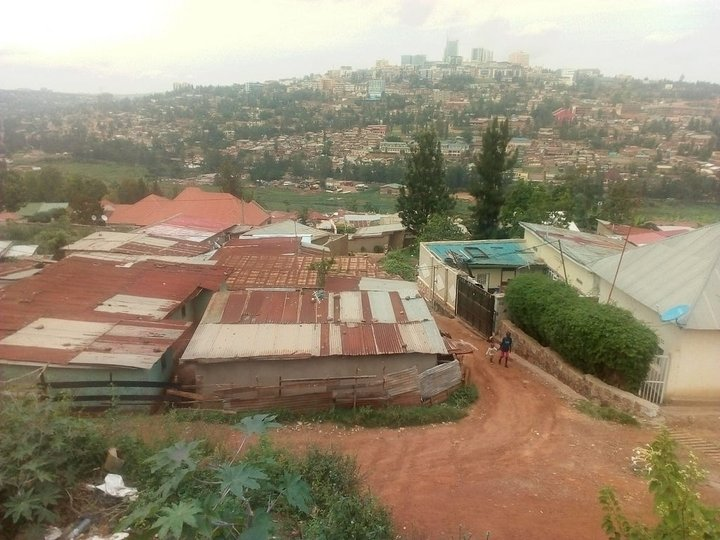

<!-- medium-cdn: https://cdn-images-1.medium.com/max/1024/1*MFTM4pj7jfMvPGVieo5eeA.jpeg -->

*Back in Kigali, the capital of Rwanda*

2.5.2. What development aid feels like on the ground

I want to say something about the operating sense of NPO and NGO work in developing countries — neither ordinary business nor government.

In both for-profit and nonprofit work, job creation itself can be development.

I have been an officer of e-commerce and BPO firms that came from Japan into Manila and Cebu. One company had about 400 people; more than 300 were Filipino. Japanese labour costs are about ten times higher, so the cost of 30 Japanese staff hires 300 people. If those 300 have regular jobs, and if in a developing country each job steadies a family of about five, that is 1,500 lives made more stable — education, food, health, housing, work. That is already a social contribution. The management team was ten or fifteen people, so each of us was, indirectly, touching about 150 lives.

As a case, Professor Yoshida of Rissho University wrote this up in chapter 10 of *Reverse Innovation in Small and Medium Enterprises*.

[https://www.amazon.co.jp/dp/4496053454/ref=cm_sw_em_r_mt_dp_DhvFFbN4Q5728](https://www.amazon.co.jp/dp/4496053454/ref=cm_sw_em_r_mt_dp_DhvFFbN4Q5728)

This project, though, is about SDG 1 and extreme poverty, in the spirit of *no one left behind*. So I will talk about the English school in rural Philippines. The scale drops by an order of magnitude: a nonprofit school of about 40 staff. In Philippine provinces with cities such as Manila or Cebu, extreme poverty is still about 20 percent. On the rural island where the school sat, it was still about 40 percent. High-rises do not make ordinary life easy. There are urban slums, and there are undeveloped farms on the edge of the same island that has a city.

With a school of 40 people we thought about local poverty. Take one million yen a year from surplus and give it to lower-income households in the school’s block. If the annual surplus were ten million yen, that would be 10 percent for the area. If a block has 1,000 residents, that reaches 100 people — 10 percent. Do it for ten years and it becomes comprehensive support for education, health, and food in the households that are struggling. Children from those homes can finish school in health, find work, and leave the poverty line. The 40 staff may already be steadying 200 lives. The contribution is larger than for staff from the city. Management was two people. Again, perhaps about 100 lives per person.

*English school: https://sp-ea.com/*

*Social-issue project 1: https://amd.tokyo/project/1129*

*Craft for Two: a project that, when school salaries stopped under COVID, linked English-school teachers, people in need in the area, and students through online English: https://peraichi.com/landing_pages/view/charityenglish*

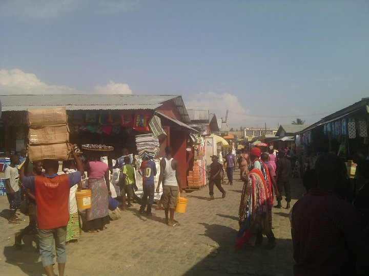

<!-- medium-cdn: https://cdn-images-1.medium.com/max/1024/1*6V_rH2jvnkIBtPTMnDw4ww.jpeg -->

*The market in Bujumbura, the capital of Burundi*

Here is the actual feel of an NPO.

TABLE FOR TWO links school and company cafeterias in Japan with meal support in developing countries (the Philippines is included) — lunches for children in school, and so on. About 500,000 meals a month; an annual budget around 200 million yen. Most of that, I think, is school lunch on site. Converted to three meals a day, that is equivalent to feeding about 166,000 people three times a day.

The accounts are on the website. From those you can guess perhaps 15 Japanese regular staff, paid, reaching the equivalent of full nutrition support for more than 160,000 children.

That is an effect of about 10,000 people per regular staff member. It is a clean, bright kind of impact. Even if food is 30 percent of living costs, it is still thousands of people. That is an order of magnitude away from the 100-person scale of the for-profit example. It is a Japanese success worth being proud of.

2.5.3. The macro picture

The last section was micro method. In a poorly developed country, you have to start with community development before anyone can put a foot on the development ladder.

The scale is in the two figures below.

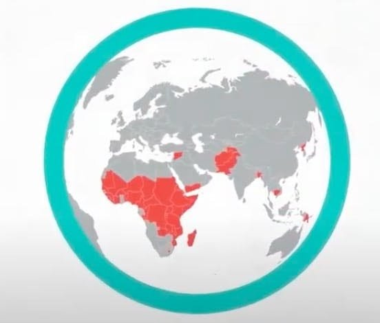

<!-- medium-cdn: https://cdn-images-1.medium.com/max/552/0*LcWD9PxNiby-OKUk -->

Figure 6. The 46 least developed countries where ending extreme poverty is hardest

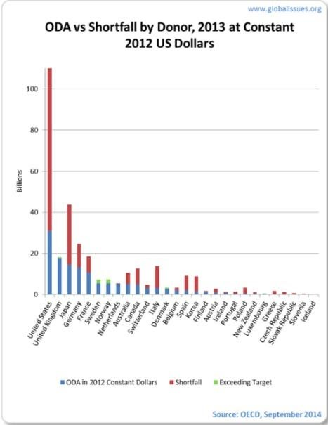

<!-- medium-cdn: https://cdn-images-1.medium.com/max/467/0*k8E4kgDCtNZnxiWY -->

Figure 7. A graph showing how far short ODA is in the United States and Japan

Marcus Manuel and colleagues at ODI, an independent UK think tank, have a current proposal for reducing extreme poverty. There is a video. It is worth watching.

[https://www.odi.org/opinion/10514-how-finance-end-extreme-poverty](https://www.odi.org/opinion/10514-how-finance-end-extreme-poverty)

The proposal is simple. The 46 least developed countries do not have enough budget.

Even for a minimum of development, tax revenue plus foreign aid is far too small. Burundi, where I am involved, has GDP per person of about 300 dollars. Japan is about 40,000 — a hundred times more. The Philippines, where I live, is about 4,000. Imagine a country whose entire circulation is two orders of magnitude smaller. What does “not enough tax” mean there? For a population of 10 million, the government budget, even with aid, is about 100 dollars per person — under 10,000 yen — under 10 billion yen in all. The country produces less than 30 billion yen a year with 10 million people, so of course there is little tax. But people living on this planet now still need a minimum of roads, houses, electricity, schools, health care, police: a place that is safe enough.

Manuel and colleagues say something plain.

Each country should raise tax as far as it can — toward Nordic levels, half of income or more — and put that first into the foundations of the state. Even in countries with large remittances, the money that arrives is spent on a family’s house and daily life. Statistics show it does not build the foundations of the whole society.

Those countries would stretch their own effort to the limit. Then the OECD/DAC countries — in practice, above all the United States and Japan — should take the 23 trillion yen they are not paying on the pledge (of which the United States owes about 10.5 trillion and Japan about 2.5 trillion) and send half of it, 11.5 trillion yen, to the least developed countries. Middle-income countries still have problems, but half should go to these 46. They are too easy to ignore and postpone.

On that arithmetic the United States could almost settle it alone. This crowdfunding page will not move Washington, so I will not labour that. A short version: the US government pays about 3.5 trillion yen a year toward an ODA obligation of about 14 trillion. Another 2 trillion already flows from private US NGOs and charities. The US charity market is about 1.5 percent of GDP — some 30 trillion yen out of 2,000 trillion — so the strategy is to ask a little more of that market to go abroad.

Japan’s charity market is only 0.1 percent of GDP. That route is closed.

(The more you think, the more your head hurts. Neither the state nor the public is meeting its contribution to Japanese society or to the international one.) TABLE FOR TWO, in the last section, is a 200 million yen operation — 0.4 percent of Japan’s 500 billion yen NPO market. Japan’s remaining responsibility to the world is about 3 trillion yen. That is 25,000 yen from each of 120 million people, used without waste.

**3. Method**

What is missing, then?

Is it not simply attention?

Theory U is a theory of change that treats innovation-scale transformation as something that can come from inner work. It draws on interviews with scientists and on meditation in traditions such as Buddhism. Otto Scharmer of MIT proposed it. He also folds in Rudolf Steiner, who shaped him and his family. MIT Sloan was founded in part to bring systems engineering into management. That systems-thinking line runs from the 1972 *Limits to Growth* work commissioned by the Club of Rome (Donella and Dennis Meadows, Jørgen Randers), through Peter Senge’s deepening of the human factor in the learning organisation, and on to Scharmer.

The cut they make on the planetary system is threefold: ecological, social, and spiritual. Onto that they put *awareness-based systems change* — the idea that a system can be changed through consciousness, or attention — and they test it.

In the Steiner spirit Scharmer founded the Presencing Institute. The hypothesis is *be the change*: not only to watch change, but to become it, and thereby shift society. As in quantum mechanics, you cannot observe a system without affecting it. Paradoxically, if you want to understand it you have to enter the system and experiment. You understand change by going in and giving it a stimulus. In engineering terms it is like putting a probe in to read the temperature.

Colleagues have used this method since the early 2010s for problem-solving training and business in the Philippines and elsewhere in Asia. Since 2016 it has been my main work as well. The English school and the trainings above use it.

Theory U pays attention to the blind spot: what ordinary life lets you miss. Japanese and American people, it turns out, miss large things. How many Japanese people know how much money goes to development aid in Africa? How many have actually gone?

Using this method, from August I have been in Ubuntu Lab, a programme meant only for people who live in Africa or are in exile. I asked to join even though I do not fit. There I am talking with the Rwanda and Burundi members about what we can do.

*Ubuntu Lab, third cohort: https://www.presencing.org/programs/ubuntu-lab-third-cohort*

**What this project wants to do**

- Where: Rwanda and Burundi

- In both countries, even a small project that helps people who need aid. These places were already poor. The aim is not to let COVID push them back below the poverty line.

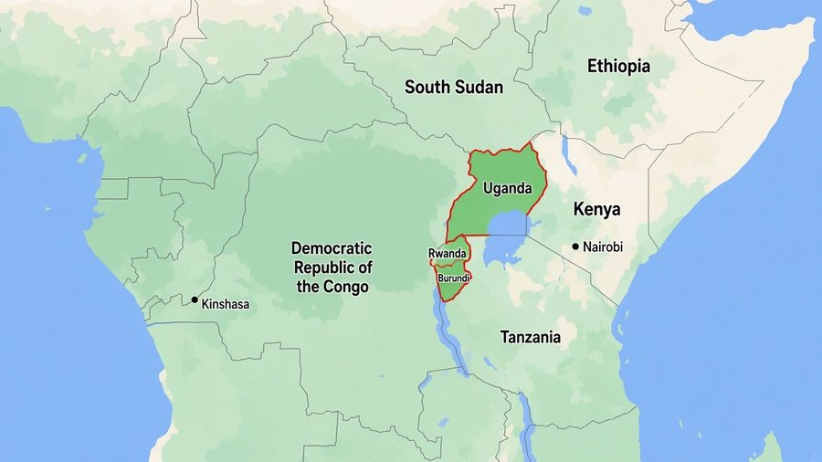

<!-- medium-cdn: https://cdn-images-1.medium.com/max/715/1*pPglNMoMn09XC_kJaq1MdA.png -->

*Where the small states of Rwanda and Burundi sit*

- Rwanda: East Africa. In 1994 about one tenth of a population of some 8 million were killed in the genocide. Population now a little over 10 million. GDP per person about 800 dollars, doubled in a decade — an East African “miracle.” The official language was shifted from French to English. Under President Kagame the capital, at least, is trying to become an IT and outsourcing country.

- Burundi: East Africa. A small twin of Rwanda. Also a little over 10 million people. After the 2015 presidential election the international community judged the process illegitimate, imposed sanctions, and aid stopped. It is reported as having little press freedom, like North Korea, and aid is tight. GDP per person about 300 dollars — among the poorest. Rwanda without the development. In June 2020 the president who had triggered the sanctions died suddenly, and the international community is watching again.

- Members

Kohei Noda:

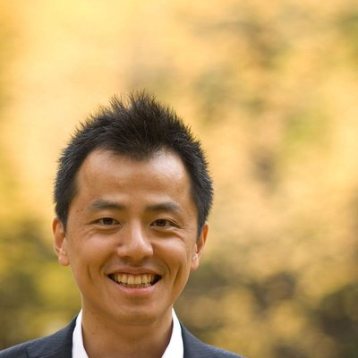

<!-- medium-cdn: https://cdn-images-1.medium.com/max/1024/0*zEZDlAlAZ1hqjQxs -->

President of Kocoro Laboratory (HR consulting and mental-health services) and a director of Ducks and Drakes (the English-school company in the Philippines). Ph.D. (academic; cognitive science, especially emotion). The work is to see how cognition, emotion, and awareness operate in the interaction of body and environment, in the same spirit as Theory U. A returnee from Germany. I have worked at a foreign consulting firm, imported and built foreign HR and psychology services, and created new businesses from academic seeds — mainly science and technology that touch people and society. Since 2013 in the Philippines the main work has been businesses that link Japan and the Philippines, and help on social problems. In this COVID year (2020) I helped start the Japanese edition of GAIA Journey, a Theory U spin-out from the COVID period, and the Japan chapter of Citizens’ Climate Lobby. From the age of 40, after moving to the Philippines, I have tried to give back some of what society gave me, and to be useful.

François Ingabire

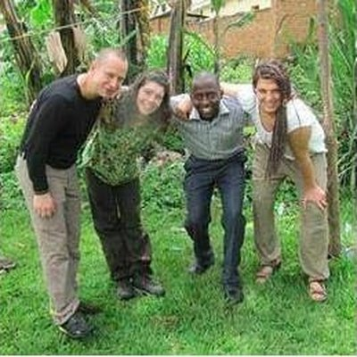

<!-- medium-cdn: https://cdn-images-1.medium.com/max/263/0*gR0xokYGTT489Pyz -->

A genocide survivor. In his early teens, in a hillside village near Kigali, he and his family and relatives lived through the genocide. He has worked with JICA volunteers, Save the Children, CARE International, and other foreign NGO and government aid projects. Founder of Rwanda’s first art festa, the Kigali Art Festival, and founder-owner of an art shop. Under COVID every business stopped.

Elijah Ndindi

<!-- medium-cdn: https://cdn-images-1.medium.com/max/1024/0*gt8iklBtIu0g2j-0 -->

From Bujumbura, the capital of Burundi. He and his wife; he has a strong presence. He speaks French and, in Burundi, English. Until the sanctions of 2015 he was local staff at the UN on the ground. In an agricultural country where 80 percent are poor and almost no one goes to university, an office job already marks an elite. After sanctions the international agencies left, and there has been no work that uses that capacity. The household is in hardship.

Iradukunda Benigne

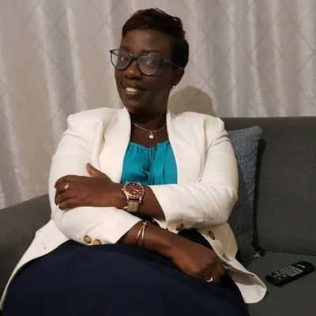

<!-- medium-cdn: https://cdn-images-1.medium.com/max/607/0*1EplPsppTJryTa1D -->

From Bujumbura. A development professional who has worked with several international NGOs.

**4. What we want this project to do**

— Concrete activities

Ideas for NPO/NGO work so far:

- Support for street children

- Support for orphanages, then a path into education

- Community development (access to water, hygiene education and support, farming)

- Support for women (small-business support for vulnerable women through microfinance; small loans for farming and livestock — livestock is climate-negative, but in rural Philippines, where I live, it is still a rare cash source for poor households)

- Support for young people (an entrepreneurship contest; seed money and mentoring for winners)

These are all things Noda and colleagues already do in Philippine cities and villages. In Rwanda and Burundi the members have, independently, come up with the same ideas.

Business ideas (these are post-COVID, not for this year):

- Tourism, limited to Kigali: inns, restaurants and cafés, car rental, tours, conferences

- Import and sale of used cars, tyres, computers and phones

- Drinks, food processing, crafts

- Coffee export

In short, every industry except farming — everything a small or mid-size investor can enter, since heavy industry is not easy. It is the same pattern as when local people in the Philippines lift the economy from below: tourism, used cars, Japanese goods, local food, coffee export.

— The change we want through the project

- Use this project to turn Japanese attention — and, over time, attention from other countries, especially the United States — toward Africa, starting with Burundi and Rwanda, where we already have a relationship. Help people see what they have not been looking at.

- Involve many people in some form.

- Attract investment or donations to the business or donation projects.

- And, as soon as we can, make the world we want on this planet: the earliest possible realisation of the UN’s SDGs for 2030.

**5. How the money will be used**

— Target amount, and concrete uses

\*Campfire’s fee is 14 percent, before tax.

The project is still deciding what to move, and how.

What has been clear since August is that, with no income, life is getting harder for everyone.

François came from a village, survived the genocide, and became a successful businessman and philanthropist. Keeping an art shop in Kigali and paying staff is now almost impossible. The customers were foreigners and the well-off. He had been about to marry; he cannot see the road ahead. He is still in this project, and he has chosen to start from social contribution rather than business.

Elijah has had no steady job since 2015. He has wanted to start a business and has had no capital, and has been hanging on in Bujumbura. This August his father was in hospital. He and his wife may soon have to leave the apartment.

Because Elijah is in such difficulty, François brought Benigne in.

I first want to pay these three some fee for actual work. For example, they could write blogs about Rwanda and Burundi now, and about their own lives, and we would pay for the writing.

Why a blog? Internet lines are unstable. Video calls and Zoom lectures are hard to run.

My own situation: this year the Philippine schools and the Japan business all stopped. I set up the minimum so that two Philippine schools could pay teachers through online English. I am now doing community development in northern Cebu. The money will run out, so I plan to return to Japan.

Even if pandemics continue, and even if climate policy cuts travel, I still intend, from next year, to contribute to development in the Philippines and to support for foreign workers in Japan.

But as I have written at length, the Philippines is a middle-income country. It is growing, and it is not abandoned. It is not a blind spot. From Japan and the United States, the complete blind spot is Africa. Governments hold TICAD and similar meetings, and almost nothing actually happens. I want this project to take on more Japanese members and actually start.

Breakdown:

Campfire fee: 14 percent of the total

Personnel: first, a very small operating fee for the local members

Volunteer project costs: not yet set

Business project costs (from next year): not yet set

**6. Schedule**

— Project timetable

30 September: first Ubuntu gathering (a conversation of eight Japanese volunteers)

Through 9 November: Campfire campaign

9 October: Ubuntu gathering (in fact the second discussion among Japanese volunteers)

19 August – 14 October: Ubuntu Lab third cohort ends

During 2020: volunteer projects start

During 2021, as ready: business projects start

\*On the fundraising method

This project will use the All-in method. Even if the target is not reached, we will carry out the plan and deliver the returns.

**7. Returns**

— What supporters receive

- A donation to the volunteer project is a donation. I want as much as possible to go to the people we are trying to help. As above, I also want local staff to write and to have some income, so the return would be activity reports from the ground.

- If I (Noda) am of any use, I will give as many seminars as wanted on Africa, poverty, and development. I research this all the time; there is much I have not written here. It would be for people who want to start learning, more than for specialists.

- Beyond Africa, poverty, and development, I can also offer returns, where I can meet the need, in the other two of the three divides that Theory U works to heal (spiritual, social, ecological): counselling, coaching, talent-development training, climate information, and so on.

**8. Closing**

— This post began because colleagues in a Japanese civic group raised money on crowdfunding for a climate book, and it stayed with me.

— A second reason: Facebook, my main social network, suggested that I use my birthday post to ask for donations to one of Facebook’s partner charities. I could have done that. If I already have my own work, why not ask for that?

— The last reason: Elijah and François have been in this project for some time, and this year they have stayed in it even while their own lives grew harder. I have heard them wonder, quietly, whether there is any paid work. If I cannot help here, where can I?

— People often ask why I work on Africa. I owed them some answer, so I have written a little of what I think. When I lived in Japan I had almost no awareness — an Ethiopia famine in primary school, a JICA pamphlet I sent for before graduation, and that was not even Africa-focused. After the 2011 disaster I may have started to pay real attention. Before I moved to the Philippines I was already writing to and visiting MDGs efforts, Millennium Promise Japan, TABLE FOR TWO, and similar work in Tokyo.

— People are sometimes surprised that I think on a span of about ten years, by analogy with 2030. I think that is simply what it means to turn attention toward something.

**9. The team, the group, and what we have done**

— Who is doing this

- See the members section above.

- There is also a Japanese volunteer group of seven, and a few Japanese people we know in each country.

— Experience and related work

- Several businesses and volunteer projects appear in the text. In short:

- In developing-country business, since 2013, about five business projects, and more than ten companies.

- Volunteer work, philanthropy, and Theory U trainings and projects on social change: about five with Japanese students and Filipinos, and about five with working adults and business owners.

- I have used Theory U for social-issue work both as business and as projects, so I can take this on in Africa with some confidence. I also want far more resources.

**10. Bank account for transfers**

Rakuten Bank, Techno branch (217), ordinary account 1913937, Kohei Noda (ノダコウヘイ)

I opened it and never used it. There is not one yen in it. I intend to use it for these donations.

People can also join with labour and value — sweat equity, ordinary shares paid in sweat. Donations to the volunteer project (not for profit), and investment in the business project (from next year), are both welcome.

Any amount, from 1,000 yen to 1 million yen, or more.
